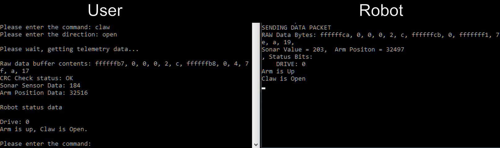

# Robot Command
This app is a 4th semester project for data communications course at Seneca College. It allows the user to send instructions over wifi using TCP/IP protocol to instruct a robot to navigate an obstacle course. The robot and its software was provided by Dr.Elliot Coleshill.

**Project Team members**:
Alex Wang,
Anthony Lovrick,
Zukhruf Khan

**Group**: 2

# Usage
1) Execute simulator.exe
2) Run ms3.sln from ms3 folder

Enjoy :)

## Additional notes
Simulator by default listens for commands on port 27000 and transmits telemetry
data on port 27501.

If you wish to change the IP address, and port numbers, you will need to specify
them at launch via command prompt

The syntax is: `simulator.exe <IP Address> <Port for Command> <Port for Telemtry>`

## Screenshot

## Video

